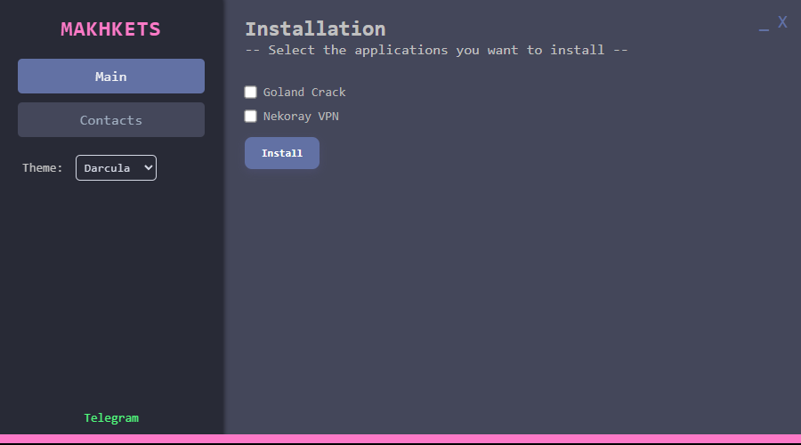
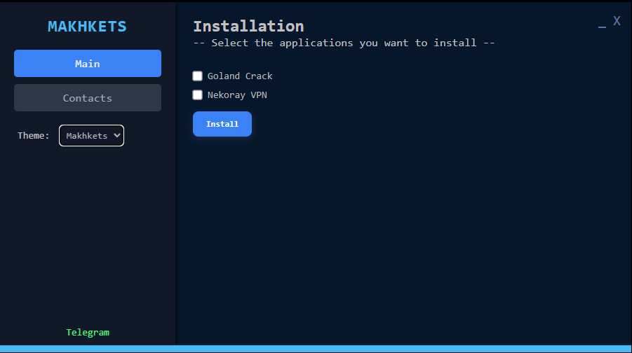

# Makhkets Downloader

|  |  |
|------------------------------------------|---------------------------------------|
| Minimalistic UI                          | Dark Mode UI                          |

**Stylish Software Downloader** — это минималистичная и удобная программа, созданная для автоматизации процесса скачивания программного обеспечения. Забудьте о ручном поиске .exe-файлов на десятках сайтов — теперь это можно сделать в пару кликов!

---

## 🎨 Особенности

- **Две стильные темы:** светлая и тёмная — под любое настроение и окружение.
- **Удобный интерфейс:** современный и интуитивно понятный.
- **Простота использования:** никаких лишних функций, только необходимое.
- **Экономия времени:** мгновенная загрузка нужного ПО без лишних шагов.

Посмотрите, как это работает:

[](demo-video.mp4)

---

## ⚙️ Технологии

**Frontend:**
- [HTML](https://developer.mozilla.org/en-US/docs/Web/HTML)
- [CSS](https://developer.mozilla.org/en-US/docs/Web/CSS)
- [](https://svelte.dev/)

**Backend:**
- [Golang](https://golang.org/)
- [](https://wails.io/)

---

## 🔧 Установка и запуск

1. Склонируйте репозиторий:
   ```bash
   git clone https://github.com/yourusername/stylish-software-downloader.git makhkets_downloader
   cd makhkets_downloader
   ```
2. Установите зависимости для backend и frontend:
   ```bash
   # Backend (Golang и Wails)
   go mod tidy

   # Frontend (Svelte)
   npm install
   ```
3. Соберите проект:
   ```bash
   wails build
   ```
4. Запустите приложение:
   ```bash
   ./build/makhkets_downloader
   ```

---

## 🌐 Платформы
- Windows
- macOS
- Linux

---

## ☕ Контрибьютинг
Хотите помочь с развитием проекта? Будем рады вашему вкладу! Пожалуйста, прочитайте [CONTRIBUTING.md](CONTRIBUTING.md) перед началом работы.

---

## 🚀 Лицензия
Проект распространяется под лицензией [MIT](LICENSE).

---

**Скачать и наслаждаться** программой можно уже сейчас! Удачи! 🙌